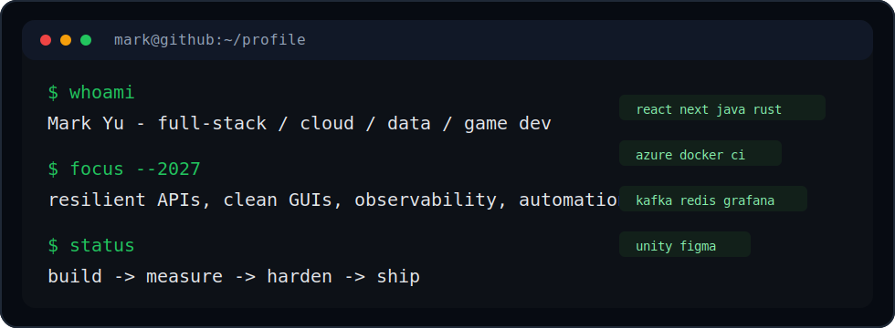

&nbsp;

&nbsp;

&nbsp;

&nbsp;&nbsp;**|**&nbsp;&nbsp;

&nbsp;

&nbsp;

---

CGQ → YQR → YYZ &nbsp;·&nbsp; focused on Rust · SAP BTP · Azure &nbsp;·&nbsp; open to Java · React · Node.js · Unity

<strong>Stats Dashboard</strong>

 

<table cellpadding="8">
<tr>
<td width="50%" align="center">

</td>
<td width="50%" align="center">

</td>
</tr>
</table>

 

 

<strong>Trophy Shelf</strong>

 

<strong>Stack</strong>

 

frontend 
  
backend 
  
data · ops 
  
creative · tools 

<strong>Now Playing</strong>

 

